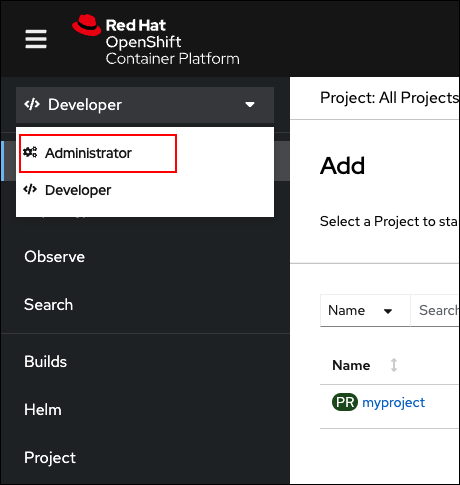
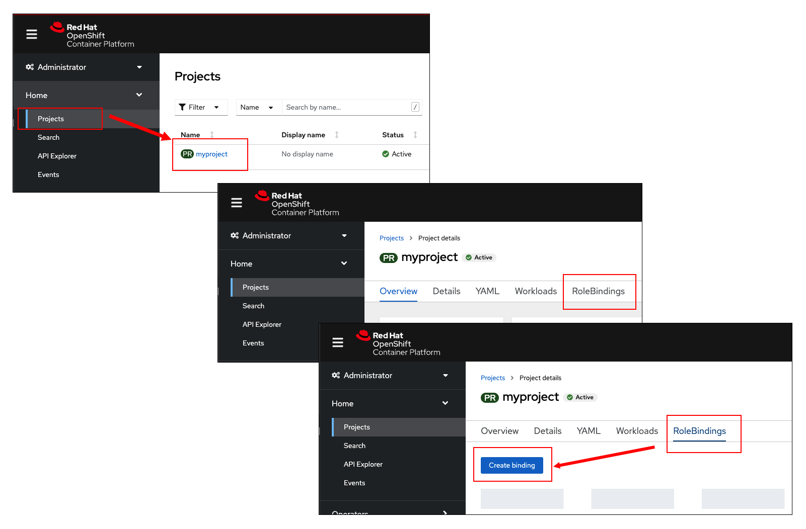
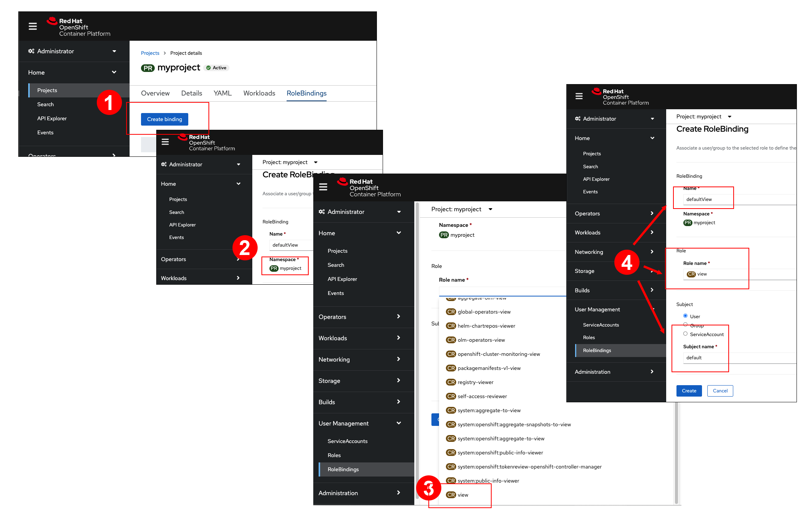

# Logging in to OpenShift

In this topic you will create a project in the OpenShift cluster and create a RoleBinding resource for that project.

To begin, let's log into our cluster.

You will deploy the OpenShift application as the `developer` user according to the following credentials:

* **Username**: `developer`
* **Password**: `developer`

----

`Step 1:` Click the **Web Console** from the row of horizontal tabs at the top of the interactive terminal window. (The **Web Console** tab is the second tab to the right.)

|NOTE:|
|----|
|You might see the following warning notification due to using an untrusted security certificate.

If you do get the warning, click the **Advanced** button to complete the process necessary to grant permission to the browser to access the OpenShift Web Console.|

----

`Step 2:`  Enter the **Username**: `developer` and **Password**: `developer` credentials into the login page as shown in the figure below.


----
Now let's log into OpenShift from the command line in the terminal window to the left.

----

`Step 3:` Click the **Terminal 1** tab on the horizontal menu at the top of this interactive learning environment.

----

`Step 4:`  Run the following command in the terminal window to the left to log into the OpenShift cluster.

```
oc login -u developer -p developer https://api.crc.testing:6443 --insecure-skip-tls-verify=true
```

You'll get the following output;

```
Connecting to the OpenShift cluster

Login successful.

You don't have any projects. You can try to create a new project, by running
    odo project create <project-name>
```

----

`Step 5:` Run the following command to create an OpenShift project named `myproject`:

```
odo project create myproject
```

You will see the following output confirming that `myproject` was created. Be advised that `odo` is now using `myproject`.

```
 ✓  Project 'myproject' is ready for use
 ✓  New project created and now using project : myproject
```

# Granting the project's service account view access to the OpenShift API

The back end of your application needs to use the OpenShift REST API in order to get communication from the front end. Thus, you need to grant the project's [service account](https://docs.openshift.com/container-platform/4.8/authentication/understanding-and-creating-service-accounts.html) view access to the OpenShift REST API.

You'll grant access by creating a [RoleBinding](https://kubernetes.io/docs/reference/access-authn-authz/rbac/#rolebinding-and-clusterrolebinding) for the project's service account. This RoleBinding will have view access to the OpenShift REST API. You'll do this task using the OpenShift web console.

----

`Step 6:` After logging into the web console, select the web console's **Administrator** perspective as shown below.




The **Administrator** perspective is a view of the console for handling operations and administrative tasks associated with your OpenShift cluster.

----

The figure below illustrates the steps you will take to work with the OpenShift web site in order to create a RoleBinding. The instructions will follow.



`Step 7a:` In the OpenShift web console, select the project you just created using `odo` (i.e. `myproject`) by clicking on `myproject` on the **Projects** tab on the left hand menu item. The Project Details page will appear.

`Step 7b:` Select `myproject` from the list. This will take you to the web page dedicated to `myproject`.

`Step 7c:` Click the **RoleBindings** tab from the horizontal menu in the `myproject` page.

In the lower left corner of the RoleBinding page you will see a button with the label **Create binding**.

`Step 7d:` Click the **Create binding** button.

Now you're going to configure the RoleBinding

# Creating the RoleBinding

The figure below illustrates the steps you will take to configure a RoleBinding. The instructions will follow.



`Step 8a:` Click the **Create binding** button to display the **Create RoleBinding** web page that you'll use to configure the RoleBinding.

`Step 8b:` In the RoleBinding page, enter the value...

```
defaultView
```

...in the **Name** textbox.

`Step 8c:` Then, in the **Role name** dropdown list select the item **(CR) view**.

`Step 8d:` Finally, in the **Subject** section at the bottom of the RoleBinding page, make sure the **User** option is selected and in the **Subject name** text textbox, enter the value:

```
default
```

`Step 8e:` Now click the button labeled **Create** at the bottom of the form.


# Creating a RoleBinding from the command line

Alternatively, the process described above can be completed via the command line by running:

```
oc adm policy add-role-to-user view --rolebinding-name=defaultview -z default
```

The result of creating the role using the `oc` command line tool will be:

```
clusterrole.rbac.authorization.k8s.io/view added: "default"
```

The default service account provided to the back-end container will now have **view** access. This means that the service account can retrieve OpenShift objects via the API.

Note that you could choose to grant access to the **edit** role instead. Providing **edit** access allows the backend to view, modify, or delete objects. The danger of giving the Service Account **edit** permissions is that a mistake in configuration could break the user experience for `wild west` app users. Thus, in this case it's safer to set the service account permissions to **view**.

# Congratulations!
You've just set up a project in OpenShift and created a RoleBinding for that project.

----

**NEXT:** Creating new binary components
