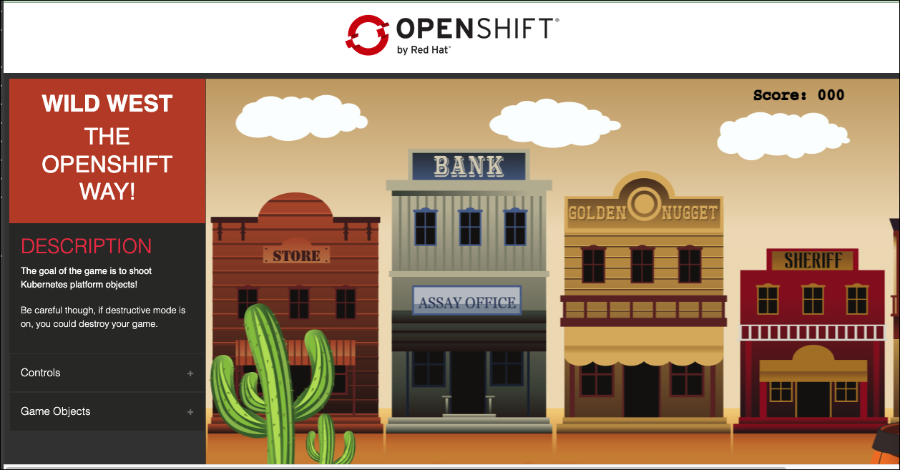

In this topic you will create a `route` in OpenShift to make the demonstration application accessible to the public on the Internet.

----

`Step 1:` Run the following command to navigate to the the `frontend` directory:

```
cd /root/frontend
```

----

Let's use `odo` to create an external URL for the demonstration application.

`Step 2:` Run the following `odo` command to create the public URL for the demonstration application

```
odo url create frontend --port 8080
```

Once the URL is created in the `frontend` component's configuration, you will see the following output:

```
 ✓  URL frontend created for component: frontend

To apply the URL configuration changes, please use `odo push`
```

----

`Step 3:`  Run the following command to push the changes into a Linux container:

```
odo push
```

`odo` will print the URL generated for the application. It should be located in the middle of the output from `odo push` similar to the output below:

```
Validation
 ✓  Validating the devfile [79612ns]

Creating Services for component frontend
 ✓  Services are in sync with the cluster, no changes are required

Creating Kubernetes resources for component frontend
 ✓  Waiting for component to start [6s]
 ✓  Links are in sync with the cluster, no changes are required
 ✓  Waiting for component to start [2ms]

Applying URL changes
 ✓  URL frontend: http://frontend-50480802-myproject.crc-dzk9v-master-0.crc.xqhfxqg1mlcp.instruqt.io/ created

Syncing to component frontend
 ✓  Checking file changes for pushing [2ms]
 ✓  Syncing files to the component [474ms]

Executing devfile commands for component frontend
 ✓  Executing install command "npm install" [5s]
 ✓  Executing run command "npm start" [1s]

Pushing devfile component "frontend"
 ✓  Changes successfully pushed to component
```

Notice that executing `odo push` returns a URL in the response in the line that starts with `✓  URL frontend`, as shown below:

```
http://frontend-app-myproject.crc-dzk9v-master-0.crc.ghds3bg5bjox.instruqt.io/
```

|NOTE:|
|----|
|The link URL is created dynamically at runtime using information that is a unique environment in which OpenShift is installed. The link you generate at the command line during this tutorial will be different.|

----

`Step 4:`  Copy that link  from the  `odo` response into your web browser's address bar. If all is well, you'll see a web page as shown in the illustration below:



# Congratulations!

 You've created an OpenShift `route` from the command line using `odo`. Also, you discovered the URL used to access the demonstration application from the Internet.

----

**NEXT:** Making changes to the source-code
