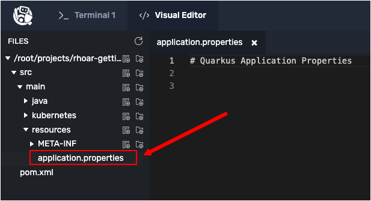

In this topic you will configure the demonstration application to bind to Kafka.


# Configuring the `application.properties` file

The [`application.properties`](https://access.redhat.com/documentation/en-us/red_hat_build_of_quarkus/1.3/html/configuring_your_quarkus_applications/proc-setting-configuration-properties_quarkus-configuration-guide) file is the place in Java programming where developers declare properties that can be used throughout out an application.

You will now insert settings into `application.properties`.

----

`Step 1:` Click the **Visual Editor** tab on the horizontal menu bar over the terminal window to the left

----

`Step 2:` Using the Visual Editor's directory tree, navigate to the directory `/root/projects/rhoar-getting-started/quarkus/kafka/src/main/resources/`.


----

`Step 3:` Click the file named `application.properties` to open the file for editing as shown in the figure below.



----

`Step 4:` Copy and paste the following code into the file named `application.properties`:

```java
# Configure the source of the incoming Kafka write stream
mp.messaging.outgoing.generated-name.bootstrap.servers=names-cluster-kafka-bootstrap.kafka.svc.cluster.local:9092
mp.messaging.outgoing.generated-name.connector=smallrye-kafka
mp.messaging.outgoing.generated-name.topic=names
mp.messaging.outgoing.generated-name.value.serializer=org.apache.kafka.common.serialization.StringSerializer

# Configure the source of the outgoing Kafka read stream
mp.messaging.incoming.names.bootstrap.servers=names-cluster-kafka-bootstrap.kafka.svc.cluster.local:9092
mp.messaging.incoming.names.connector=smallrye-kafka
mp.messaging.incoming.names.value.deserializer=org.apache.kafka.common.serialization.StringDeserializer
```
----

The names of the properties for the Kafka extension are structured as follows:

```
mp.messaging.[outgoing|incoming].{channel-name}.property=value
```

**WHERE:**

The `channel-name` segment must match the value set in the `@Incoming` and `@Outgoing` annotations.


----

`Step 5:` Click on the `Disk` icon or press `CTRL+S` to save the file.

The hostnames used above refer to the in-cluster hostnames that resolve to our running Kafka cluster on OpenShift.

More details about this configuration is available on the [Producer
configuration](https://kafka.apache.org/documentation/#producerconfigs) and [Consumer
configuration](https://kafka.apache.org/documentation/#consumerconfigs) section from the Kafka documentation.

|NOTE: What about `my-data-stream`?|
|----|
|`my-data-stream` is an in-memory stream that is not connected to a message broker.|

# Executing compilation tests

Let's do an informal test to make sure that the code is in the proper place and that the code can be compiled.

----

`Step 6:` Click on the **Terminal 1** tab in the horizontal menu bar on top of the window to the left.

----

`Step 7:` Run the following command in **Terminal 1** window to compile and package the app:

```
mvn clean package -f /root/projects/rhoar-getting-started/quarkus/kafka
```

You will see a lot of screen output after you execute `mvn clean package`.

Upon success, you will get output similar to the following:

```
[INFO] Building jar: /root/projects/rhoar-getting-started/quarkus/kafka/target/people-1.0-SNAPSHOT.jar
[INFO]
[INFO] --- quarkus-maven-plugin:2.0.0.Final:build (default) @ people ---
[INFO] [org.jboss.threads] JBoss Threads version 3.4.0.Final
[INFO] [io.quarkus.deployment.QuarkusAugmentor] Quarkus augmentation completed in 2507ms
[INFO] ------------------------------------------------------------------------
[INFO] BUILD SUCCESS
[INFO] ------------------------------------------------------------------------
[INFO] Total time:  20.424 s
[INFO] Finished at: 2022-04-11T23:28:14Z
[INFO] ------------------------------------------------------------------------
```


**Congratulations!**

You've added configuration settings to the `application.properties` file. The configuration settings bind the application to a Kafka instance. Also, you ran an informal test to ensure that the modifications you made the to source code compiles.

----

**NEXT:** Deploying Kafka to OpenShift
