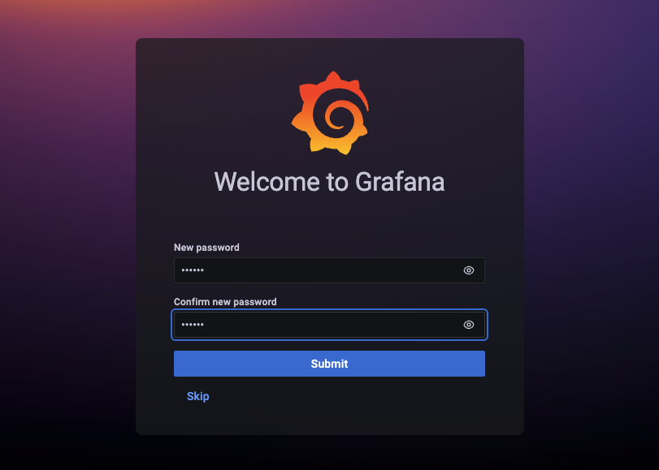
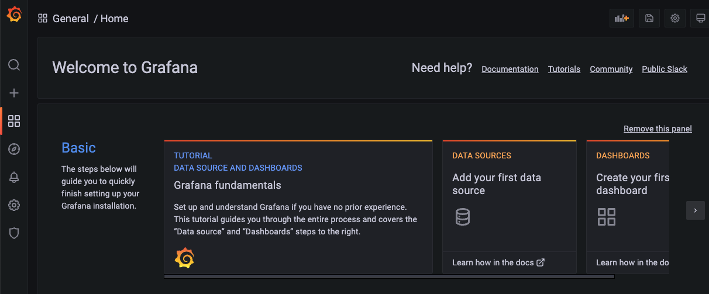
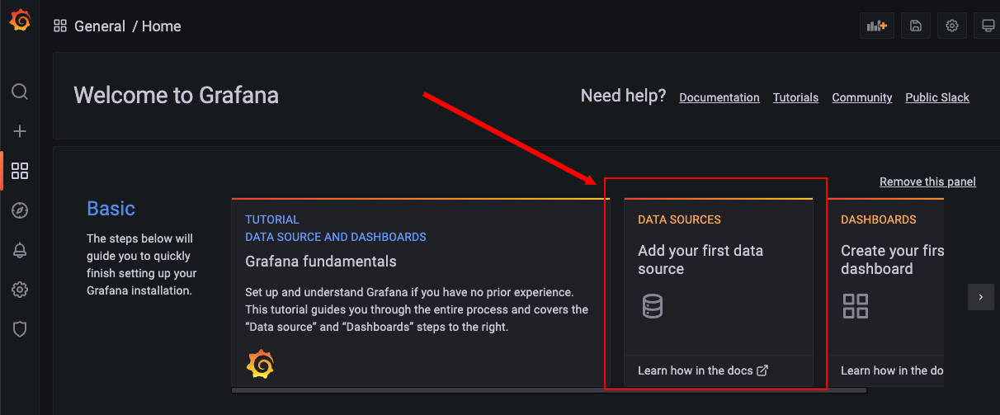
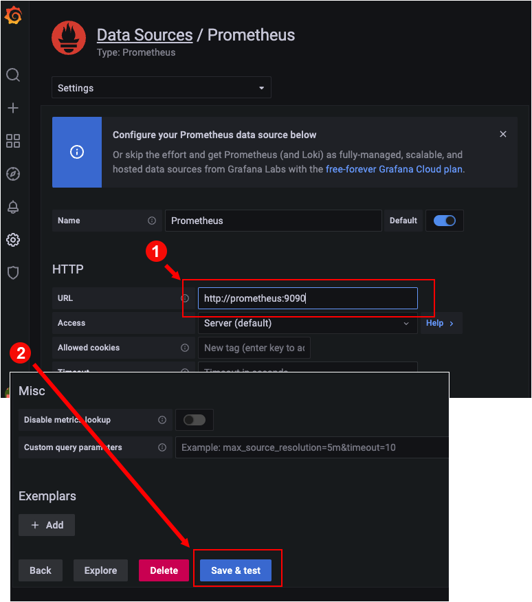
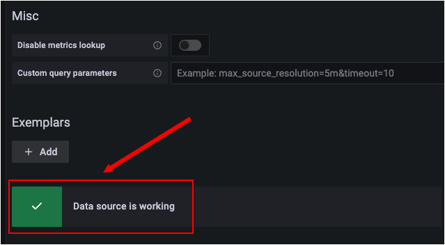

In this topic you will start by submitting random numbers continuously to the demonstration application in order to do prime number verification. Then, you'll deploy and expose Grafana as a new application running under OpenShift.

You'll log into Grafana using its web UI. Then you'll set a password as required when logging in for the first time.

# Deploying Grafana to the OpenShift Cluster

`Step 1:` Run the following command in **Terminal 1** to deploy Grafana to your cluster:

```
cd /root && oc new-app quay.io/openshift/origin-grafana
```

You'll get output similar to the following:

```
--> Found container image a4800ec (2 months old) from quay.io for "quay.io/openshift/origin-grafana"

    Grafana
    -------
    Grafana is an open-source, general purpose dashboard and graph composer

    Tags: openshift

    * An image stream tag will be created as "origin-grafana:latest" that will track this image

--> Creating resources ...
    imagestream.image.openshift.io "origin-grafana" created
    deployment.apps "origin-grafana" created
    service "origin-grafana" created
--> Success
    Application is not exposed. You can expose services to the outside world by executing one or more of the commands below:
     'oc expose service/origin-grafana'
    Run 'oc status' to view your app.
```

----

`Step 2:` Run the following command in **Terminal 1** to expose Grafana as an OpenShift service:

```
oc expose svc/origin-grafana
```

You'll get output similar to the following:

```
route.route.openshift.io/origin-grafana exposed
```
|NOTE:|
|----|
|It may take up to a minute to finish deploying.|

----

`Step 3:` Run the following command in **Terminal 1** to verify that Grafana is up and running:

```
oc rollout status -w deployment/origin-grafana
```

You'll get the following output:

```
deployment "origin-grafana" successfully rolled out
```

# Opening the Grafana dashboard

`Step 4:` Run the following command in **Terminal 1** to get the URL for the OpenShift route you'll use to access the Grafana GUI:

```
oc get route origin-grafana -n quarkus -o jsonpath='{"http://"}{.spec.host}'
```

You'll get output similar to the following, but the exact URL will be different for your instance:

```
http://origin-grafana-quarkus.crc-gh9wd-master-0.crc.ihd2pmeddknj.instruqt.io
```

----

`Step 5:` Copy the route URL into the address bar of a new browser tab or window.

----

`Step 6:` Log into the Grafana GUI using the following default credentials as shown in the figure below:


  - Username: `admin`
  - Password: `admin`


Once logged into Grafana you are required to provide a new password.

----

`Step 7:` At the change password prompt, enter and confirm a new password as shown in the figure below.



The next task is to add Prometheus to Grafana as a data source.

# Add Prometheus as a data source

Upon your successful login, you’ll land on the Welcome to Grafana page as shown in the figure below.



----

`Step 8:` From within the Welcome to Grafana page, click the **Add your first data source** text block as shown in the figure below.



A searchable list of common data sources will appear.

----

`Step 9a:` Type the text `Prometheus` in the search text box as shown in the figure below:


The Prometheus text block will appear.

`Step 9b:` Click the `Select` button on the right side of the Prometheus text block as shown in the figure above.

The Prometheus configuration page will appear.

----

`Step 10a:` In the URL box, enter the following URL as shown in the figure below.

```
http://prometheus:9090
```



The URL `http://prometheus:9090` is the host name and port of running Prometheus in the OpenShift application namespace.


`Step 10b:` After entering the URL, scroll down the page and click the button labeled `Save & test` as shown in the figure above.

|WARNING|
|----|
|If you skip over adding and saving the URL `http://prometheus:9090`, you will get errors and the rest of the track will not work.|

When Prometheus is correctly confirmed in the web page, you'll see a success message `Data source is working` after you click the `Save & test` as shown below.



# Congratulations!

You now have Grafana up and running. Also, you added Prometheus as a data source in Grafana. Next, you'll create a Grafana dashboard that displays data captured by Prometheus.

----

**NEXT:** Creating the Grafana dashboard
