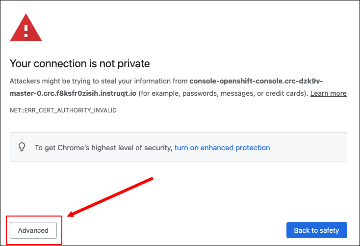
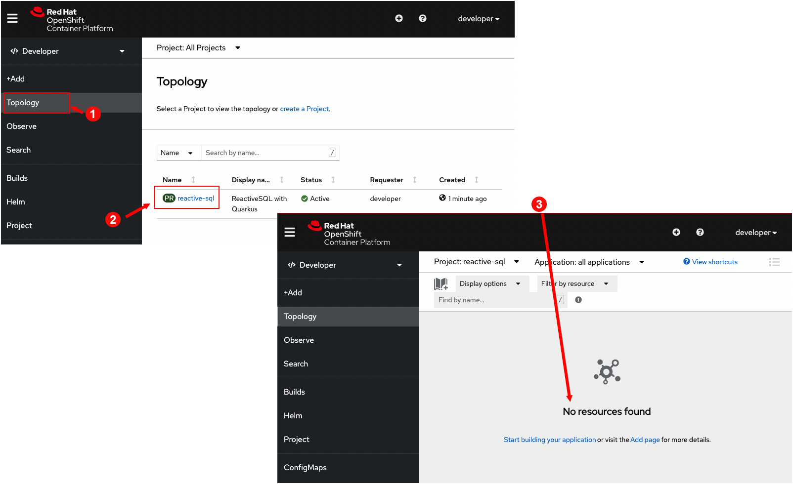
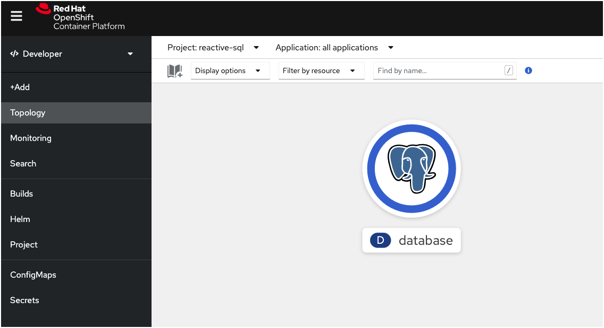
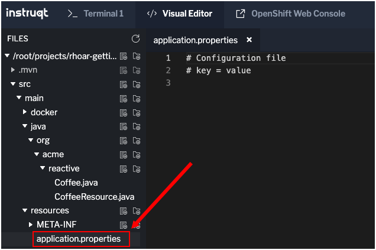
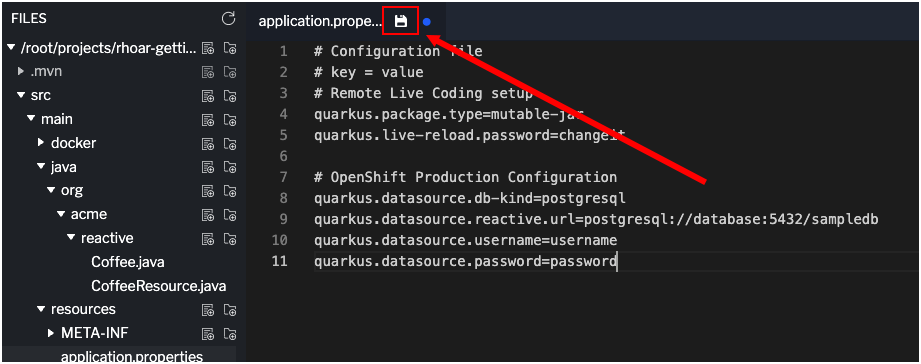
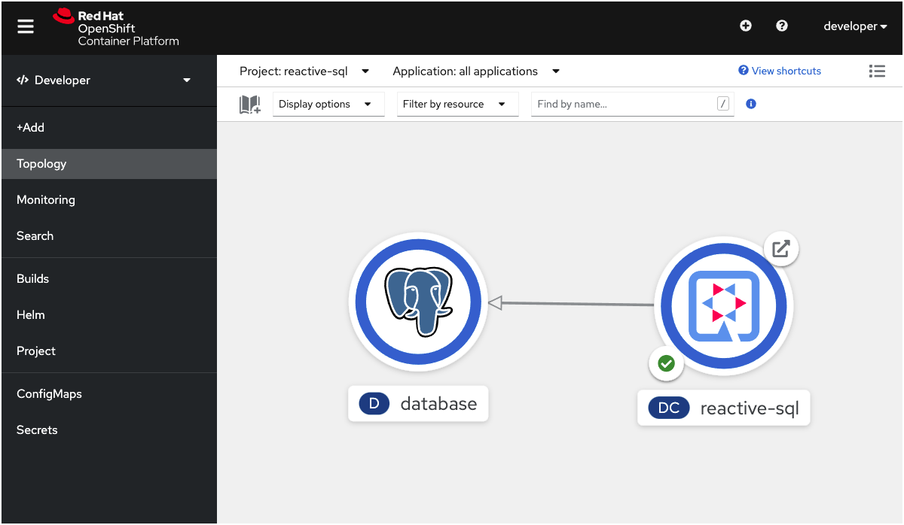
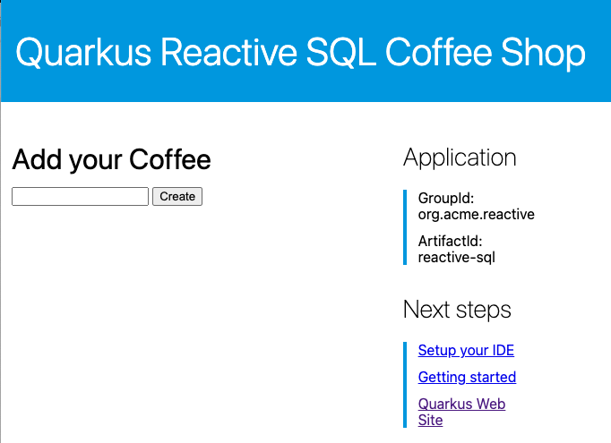
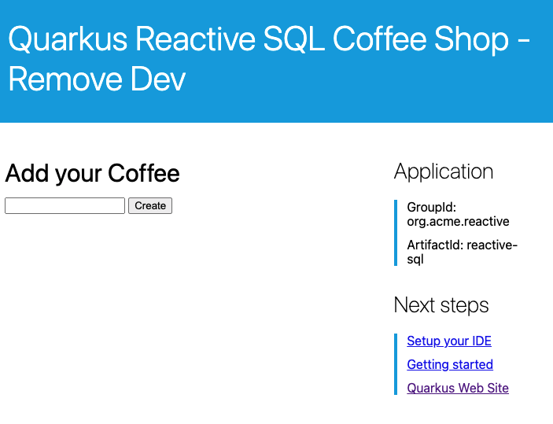

# Understanding Remote Live Coding

A key feature of Quarkus is the ability to configure an application in remote development mode so that making changes to local files will immediately cascade into the remote container environment that hosts the application while the application is running.

The changes made locally are visible immediately on the remote deployment running on OpenShift.

This feature is called Live Coding.

Live Coding allows you to develop code and services running remotely in real time.

In this track you'll deploy the demonstration application to OpenShift and connect it to your local environment. The end result will be a fully functional application that's already running on the OpenShift target platform.

# Accessing the OpenShift web console

OpenShift ships with a web console that allows users to perform tasks via a browser.

----

`Step 1a:` Click the **OpenShift Web Console** tab on the horizontal menu bar over the console window to the left to view the login screen.

|NOTE:|
|----|
|You might see the following warning notification due to using an untrusted security certificate.

If you do get the warning, click the **Advanced** button to complete the process necessary to grant permission to the browser to access the OpenShift web console.|

`Step 1b:` Log in using the following credentials as shown in the figure below:

* Username: `developer`
* Password: `developer`


`Step 1c:` Click the **Skip Tour** button to skip the new user introduction.

----

`Step 2:` Run the following command in **Terminal 1** to log in with the OpenShift CLI:

```
oc login -u developer -p developer
```

You will see the following output:

```
Login successful.

You don't have any projects. You can try to create a new project, by running

    oc new-project <projectname>
```

# Accessing the OpenShift project

In this track, you will create a project in OpenShift to host the demonstration application and the associated PostgresSQL database.

----

`Step 3:` Run the following command in **Terminal 1** to create a `reactive-sql` project with the display name `ReactiveSQL with Quarkus`:

```
oc new-project reactive-sql --display-name="ReactiveSQL with Quarkus"
```

You will get output similar to the following:

```
Now using project "reactive-sql" on server "https://api.crc.testing:6443".

You can add applications to this project with the 'new-app' command. For example, try:

    oc new-app rails-postgresql-example

to build a new example application in Ruby. Or use kubectl to deploy a simple Kubernetes application:

    kubectl create deployment hello-node --image=k8s.gcr.io/serve_hostname
```

----

`Step 4:` Return to the **OpenShift Web Console** and click the **Topology** button on the vertical menu bar on the left. Then, click the link
`reactive-sql`.  You'll be presented with a page displaying the text `No resources found` as shown in the figure below.




# Deploying the PostgresSQL database

`Step 5:` Run the following command in **Terminal 1** to to deploy a PostgresSQL database instance to the new project:

```
oc new-app \
    -e POSTGRESQL_USER=username \
    -e POSTGRESQL_PASSWORD=password \
    -e POSTGRESQL_DATABASE=sampledb \
    --name=database \
    -l app.openshift.io/runtime=postgresql \
    openshift/postgresql
```

You'll see the following output:

```
--> Found image d41bd78 (8 months old) in image stream "openshift/postgresql" under tag "13-el8" for "openshift/postgresql"

    PostgreSQL 13
    -------------
    PostgreSQL is an advanced Object-Relational database management system (DBMS). The image contains the client and server programs that you'll need to create, run, maintain and access a PostgreSQL DBMS server.

    Tags: database, postgresql, postgresql13, postgresql-13


--> Creating resources with label app.openshift.io/runtime=postgresql ...
    deployment.apps "database" created
    service "database" created
--> Success
    Application is not exposed. You can expose services to the outside world by executing one or more of the commands below:
     'oc expose service/database'
    Run 'oc status' to view your app.
```


----

`Step 6:` Return to the **OpenShift Web Console** tab. You'll see the Postgres pod spinning up from the Topology view in the web console as shown in the figure below.



# Adding the Quarkus OpenShift extension

Quarkus offers the ability to automatically generate OpenShift resources based on both default and user supplied configuration settings.

The OpenShift extension is actually a wrapper extension that brings together the [Kubernetes](https://quarkus.io/guides/deploying-to-kubernetes) and [container-image-s2i](https://quarkus.io/guides/container-image#s2i) extensions.

----

`Step 7:` Run the following command in **Terminal 1** to add the OpenShift extension to the Quarkus project:

```
mvn quarkus:add-extension -Dextensions="openshift" -f /root/projects/rhoar-getting-started/quarkus/reactive-sql
```

You will see output similar to the following:

```
[INFO] Scanning for projects...
[INFO]
[INFO] -------------------< org.acme.reactive:reactive-sql >-------------------
[INFO] Building reactive-sql 1.0.0-SNAPSHOT
[INFO] --------------------------------[ jar ]---------------------------------
[INFO]
[INFO] --- quarkus-maven-plugin:2.0.0.Final:add-extension (default-cli) @ reactive-sql ---
[INFO] [SUCCESS] ?  Extension io.quarkus:quarkus-openshift has been installed
[INFO] ------------------------------------------------------------------------
[INFO] BUILD SUCCESS
[INFO] ------------------------------------------------------------------------
[INFO] Total time:  2.387 s
[INFO] Finished at: 2022-05-17T19:49:42Z
[INFO] ------------------------------------------------------------------------
```

# Configuring Quarkus for Remote Live Coding

`Step 8a:` Go the **Visual Editor** tab on the horizontal menu bar over the console window to the left.

`Step 8b:` Navigate to the file `src/main/resources/application.properties` as shown in the figure below.



`Step 8c:` Click on the file `src/main/resources/application.properties` to open it for editing.

`Step 8d:` Copy and paste the following values to the end of the `application.properties` file:

```java
# Remote Live Coding setup
quarkus.package.type=mutable-jar
quarkus.live-reload.password=changeit

# OpenShift Production Configuration
quarkus.datasource.db-kind=postgresql
quarkus.datasource.reactive.url=postgresql://database:5432/sampledb
quarkus.datasource.username=username
quarkus.datasource.password=password
```

|NOTE:|
|----|
|You can change the remote live-reload username/password pair defined by `quarkus.datasource.username` and `quarkus.datasource.password` in the `application.properties` file to whatever you want. Those credentials are used to secure communication between the remote side and the local side.

`Step 8e:` Click on the `Disk` icon or press `CTRL+S` to save the file as shown in the figure below:




**KEY POINTS TO UNDERSTAND**

* The `quarkus.package.type=mutable-jar` setting in the `application.properties` file instructs Quarkus to package the application as a `mutable application`.
* Mutable applications include the parts that Quarkus needs at deployment times and also to support `dev` mode. As a result, a `mutable application` can take up a bit more disk space.
* When a `mutable application` is **not** run in `dev mode` it starts just as fast and uses the same memory as an immutable application.
* You can configure Quarkus to use the Postgres database using the term `database` as the hostname, as shown below in Step 9 for the parameter `-Dquarkus.openshift.annotations.\"app.openshift.io/connects-to\"=database`. OpenShift will resolve the hostname `database` to the running Postgres database.

# Deploying the demonstration application to OpenShift

`Step 9:` Run the following command in **Terminal 1** to build and deploy the demonstration Quarkus application in OpenShift:

```
mvn clean package -DskipTests -f /root/projects/rhoar-getting-started/quarkus/reactive-sql \
-Dquarkus.kubernetes.deploy=true \
-Dquarkus.container-image.build=true \
-Dquarkus.kubernetes-client.trust-certs=true \
-Dquarkus.kubernetes.deployment-target=openshift \
-Dquarkus.openshift.route.expose=true \
-Dquarkus.openshift.annotations.\"app.openshift.io/connects-to\"=database \
-Dquarkus.openshift.env.vars.QUARKUS_DATASOURCE_DEVSERVICES=false \
-Dquarkus.openshift.env.vars.quarkus-launch-devmode=true
```

There will be a lot of output to the screen. The installation might take a minute or two.

Eventually, upon a successful installation, you will get output similar to the following:

```
[INFO] ------------------------------------------------------------------------
[INFO] BUILD SUCCESS
[INFO] ------------------------------------------------------------------------
[INFO] Total time:  01:44 min
[INFO] Finished at: 2022-05-17T21:43:39Z
[INFO] ------------------------------------------------------------------------
```

**KEY POINTS TO UNDERSTAND**

* `quarkus.kubernetes.deploy=true` - Indicates the extension to deploy to OpenShift after the container image is built.
* `quarkus.container-image.build=true` - Indicates the extension to build a container image.
* `quarkus.kubernetes-client.trust-certs=true` - Indicates that the application is using self-signed certs. Quarkus will trust the certificates by default.
* `quarkus.kubernetes.deployment-target=openshift` - Indicates the extension to generate and create the OpenShift resources after building the container. Examples of OpenShift resources are `DeploymentConfig`s and `Service`s.
* `quarkus.openshift.route.expose=true` - Indicates the extension to generate an OpenShift `Route` so that the application is accessible from a browser.
* `quarkus.kubernetes.annotations."app.openshift.io/connects-to"=database` - Adds a visual connector to show the DB connection in the web console topology view.
* `quarkus.openshift.env.vars.QUARKUS_DATASOURCE_DEVSERVICES=false` - Disables Quarkus dev services because these are not needed on OpenShift.
* `quarkus.openshift.env.vars.quarkus-launch-devmode=true` - Sets an environment variable in the container to tell Quarkus to launch in `dev mode`, not production mode, which is the default when deploying to Kubernetes or OpenShift.

----

`Step 10:` Run the following command in **Terminal 1** to verify that the application rollout has been completed:

```
oc rollout status -w dc/reactive-sql
```

Eventually you will see the following output:

```
Waiting for rollout to finish: 0 of 1 updated replicas are available...
Waiting for latest deployment config spec to be observed by the controller loop...
replication controller "reactive-sql-1" successfully rolled out
```

|NOTE|
|----|
|If the `oc rollout` command appears to not be finishing, press the `CTRL-C` keys to cancel the process. Then run the command again.|

----

`Step 11:` Return to the **OpenShift Web Console** tab. You will see two circular graphics indicating that both the PostgresSQL database and Quarkus reactive application are running, as shown in the figure below.



----

`Step 12:` Run the following command in **Terminal 1** extract the application's Route from the Topology view:

```
export APP_ROUTE=`oc get route reactive-sql -n reactive-sql -o jsonpath='{"http://"}{.spec.host}'`
echo $APP_ROUTE
```

You'll get output similar to the following:

```
http://reactive-sql-reactive-sql.crc-dzk9v-master-0.crc.hbie33wmyvpb.instruqt.io
```

(The actual details of your URL will differ because each running instance of OpenShift will have a unique URL.)

|NOTE|
|----|
|It may take a few seconds for the app to work and the networking to get glued together. If the web page doesn't appear, reload the browser until it does.|

----

`Step 13:` Copy and past the URL returned from the `oc get route...` command in to the address bar in a browser window. You will see a web page like so:



The demonstration application is now up and running.

Leave the demonstration application running in order to experiment with using Quarkus' Remote Live Reload feature to automatically update the application as you make changes.

# Connecting the demonstration application in remote dev mode

You are now ready to run the demonstration application in `dev mode` and connect it to the remote instance running in OpenShift.

----

`Step 14:`  Run the following command in **Terminal 1** to connect to the demonstration application in `dev mode`:

```
mvn quarkus:remote-dev -Dquarkus.live-reload.url=$APP_ROUTE -f /root/projects/rhoar-getting-started/quarkus/reactive-sql
```

You will see output similar to the following snippet of code:

```
[INFO] Scanning for projects...
[INFO]
[INFO] -------------------< org.acme.reactive:reactive-sql >-------------------
[INFO] Building reactive-sql 1.0.0-SNAPSHOT
[INFO] --------------------------------[ jar ]---------------------------------
[INFO]
[INFO] --- quarkus-maven-plugin:2.0.0.Final:remote-dev (default-cli) @ reactive-sql ---
[INFO] Using 'UTF-8' encoding to copy filtered resources.
.
.
.
```

The command entered in **Terminal 1** will start the application in `dev mode`. The **Terminal 1** window will keep running the process. You won't be able execute commands in **Terminal 1**.

However, you can make code changes using the **Visual Editor**. The changes you make in **Visual Editor** will show up immediately in the remote instance of the application running on OpenShift.


# Updating the demonstration application using Live Coding

Let's modify the demonstration application's web page by making a change to the file, `src/main/resources/META-INF/resources/index.html`.

You'll add the text ` - Remote Dev` to the banner text.

----

`Step 15a:` Using the **Visual Editor**, navigate to the file `src/main/resources/META-INF/resources/index.html`.

`Step 15c:` At `Line 110` change the text from `Quarkus Reactive SQL Coffee Shop` to `Quarkus Reactive SQL Coffee Shop - Remove Dev` as shown in the figure below.


`Step 15d:` Click on the `Disk` icon or press `CTRL+S` to save the file.

----

`Step 16:` Return to the web browser window where you loaded the demonstration application's web page. You will see that the HTML page on OpenShift has updated automatically as shown in the figure below.



# Congratulations!

You've learned how to set up a remote connection to the demonstration application, enabling Live Coding as it runs in OpenShift

----

**NEXT:** Creating the reactive CoffeeResource endpoints

