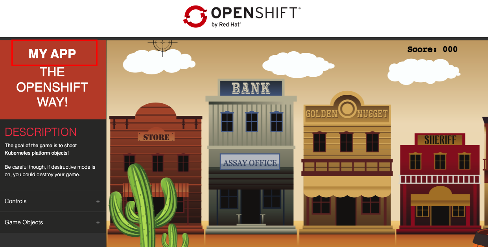

In this topic you will alter the source code for the demonstration application and redeploy it automatically with the help of `odo`.

Previously you deployed the first version of the Wild West demonstration application and viewed it in a browser. Let's look at how OpenShift and `odo` help make it easier to make changes to an app once it's running.

----

`Step 1:` Run the following command in the terminal window to navigate to the `frontend` directory:


```
cd /root/frontend
```

----

`Step 2:` Run the  `odo watch` command to tell `odo` to `watch` for changes on the file system in the background:

```
odo watch &
```

Notice that the `&` is included to run `odo watch` in the background for this tutorial. Typically in the real world you'd open an separate terminal window and run the command there.

You'll see output similar to the following:

```
[1] 803
root@container:~/frontend# Waiting for something to change in /root/frontend
```

Notice that the command prompt is followed by this message `Waiting for something to change in /root/frontend`. This is OK. You can still enter a command in the terminal.

----

Currently, the title of the Wild West game application is "Wild West The OpenShift Way!" Let's change it.


We will change this to "`My App` The OpenShift Way!"

The way we will make the change is to run the Linux [`sed`](https://www.gnu.org/software/sed/manual/sed.html) command against the file  `/root/frontend/index.html`. The `sed` command will traverse the `index.html` file and change occurrences of `Wild West` to `My App`.

----

`Step 3:` Run the following command to edit the file `index.html` with the search-and-replace one-liner.

```
sed -i "s/Wild West/My App/" index.html
```

There may be a slight delay before `odo` recognizes the change. Once the change is recognized, `odo` will automatically push the changes to the `frontend` component and print its status to the terminal as shown in the snippet of output the follows:

```
File  changed
Pushing files...

Validation
 ✓  Validating the devfile [99851ns]

Creating Services for component frontend
 ✓  Services are in sync with the cluster, no changes are required
 .
 .
 .
```

When the automated push process completes, you'll see output similar to the following snippet:

```
.
.
.
Syncing to component frontend
 ✓  Checking file changes for pushing [1ms]
 ✓  Syncing files to the component [296ms]

Executing devfile commands for component frontend
 ✓  Executing install command "npm install" [2s]
 ✓  Executing run command "npm start" [1s]
Waiting for something to change in /root/frontend
```

Refresh the application's page in the web browser. You will see the new name in the web interface for the application as shown in the figure below:



----
**NOTE:**

If you no longer have the application page opened in a browser, you can recall the application's URL by running the following command:

```
odo url list
```
You'll get output similar to the following:

```
Found the following URLs for component frontend
NAME         STATE      URL                                                                               PORT     SECURE     KIND
frontend     Pushed     http://frontend-app-myproject.crc-lgph7-master-0.crc.l2bwmvk0f3e4.instruqt.io     8080     false      route
```
----
# Congratulations!

 You've learned how to use `odo` to change the content of an application and redeploy it automatically at runtime.

----

This is the final topic in this track.

# What's Next?

Congratulations on completing this lab. Keep learning about OpenShift:

* Visit the [Red Hat Developer learning page](https://developers.redhat.com/learn) for more labs and resources
* [Want to try a free, instant 30-day OpenShift cluster? Get started with the Developer Sandbox for Red Hat OpenShift](https://developers.redhat.com/developer-sandbox)

Don't forget to finish the lab and rate your experience on the next page. Thanks for playing!
