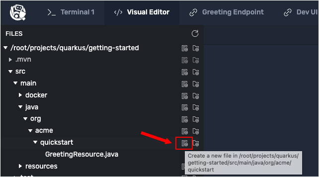
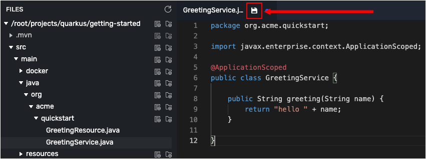
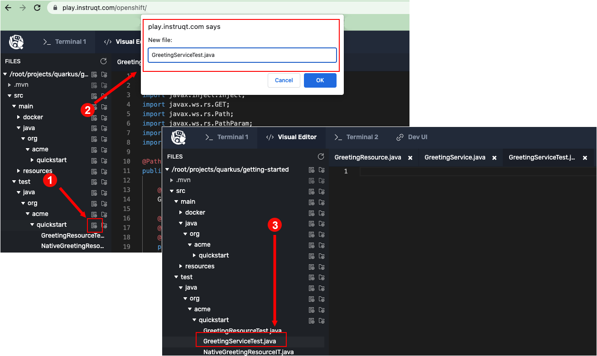

In the previous step you created a basic RESTful Java application with Quarkus. In this topic you'll add a custom [CDI bean](https://access.redhat.com/documentation/en-us/red_hat_jboss_enterprise_application_platform/7.2/html/development_guide/contexts_and_dependency_injection) that uses the Quarkus **ArC** extension.  ArC is a [CDI](https://www.cdi-spec.org/)-based dependency injection [solution](https://quarkus.io/guides/cdi-reference.html) tailored for the Quarkus architecture.

# Adding the custom CDI bean to the RESTful application

The custom CDI bean you're going to add will create an additional endpoint to the demonstration API application.

The new endpoint will be `/hello/greeting/{name}`. You will substitute a value on the `{name}` parameter at runtime, for example `/hello/greeting/Barry`.

----

`Step 1` Click the **Visual Editor** tab in the horizontal menu bar above the interactive terminal window on the left.

----

`Step 2:` Once the editor is open, go to the directory tree on the left side of the editor and navigate the directory `./getting-started/src/main/java/org/acme/quickstart/`

----

`Step 3:` Create the file `GreetingService.java` by clicking the **New File** icon as shown in the figure below.



----

`Step 4a:` And the following code to the newly created file `GreetingService.java`.

```java
package org.acme.quickstart;

import javax.enterprise.context.ApplicationScoped;

@ApplicationScoped
public class GreetingService {

    public String greeting(String name) {
        return "hello " + name;
    }

}
```

`Step 4b:` Save the `GreetingService.java` file by clicking the **Save File** icon as shown in the figure below:



----

`Step 5a:`  Reopen the file `GreetingResource.java` and replace all the code in that file with the code shown below.

```java
package org.acme.quickstart;

import javax.inject.Inject;
import javax.ws.rs.GET;
import javax.ws.rs.Path;
import javax.ws.rs.PathParam;
import javax.ws.rs.Produces;
import javax.ws.rs.core.MediaType;

@Path("/hello")
public class GreetingResource {

    @Inject
    GreetingService service;

    @GET
    @Produces(MediaType.TEXT_PLAIN)
    @Path("/greeting/{name}")
    public String greeting(@PathParam("name") String name) {
        return service.greeting(name);
    }

    @GET
    @Produces(MediaType.TEXT_PLAIN)
    public String hello() {
        return "Hello RESTEasy";
    }
}
```

`Step 5b:` Save the file `GreetingResource.java` by clicking the **Save File** icon

----

The code you added above will create a new endpoint in the demonstration API application. That new endpoint is `hello/greeting/{name}`.

Notice that the endpoint has the parameter `{name}` defined in the URL. The value passed to the parameter will be appended to the API response.

Thus, a call to `/hello/greeting/Barry` will result in the response `hello Barry`.


# Inspecting the results

Let's verify that the new code works according to expectation.

`Step 6:` Click the **Terminal 2** tab on the horizontal menu bar over the pane to the left.

----

`Step 7:` Run the following command in the **Terminal 2** window that appears:

```console
curl -w "\n" localhost:8080/hello/greeting/quarkus
```

You'll get the following output:

```
hello quarkus
```

You are seeing `hello quarkus` because `quarkus` is the value of the `{name}` parameter prescribed in the endpoint URL `hello/greeting/{name}`.


# Adding a unit test

Let's add another test for Quarkus to run continuously. The new test will exercise the new endpoint  `hello/greeting/{name}`

----

`Step 8:` Bring up the visual editor in the **Visual Editor** tab over the terminal window to the left.

----

`Step 9:` Navigate to the testing directory `getting-started/src/test/java/org/acme/quickstart/`

----

`Step 10:` Click the **New File** icon and create a file named `GreetingServiceTest.java` as shown in the figure below.



----

`Step 11a:` Add the following code to the file `GreetingServiceTest.java`:

```java
package org.acme.quickstart;

import io.quarkus.test.junit.QuarkusTest;
import org.junit.jupiter.api.Test;

import java.util.UUID;

import static io.restassured.RestAssured.given;
import static org.hamcrest.CoreMatchers.startsWith;

@QuarkusTest
public class GreetingServiceTest {

    @Test
    public void testGreetingEndpoint() {
        String uuid = UUID.randomUUID().toString();
        given()
          .pathParam("name", uuid)
          .when().get("/hello/greeting/{name}")
          .then()
            .statusCode(200)
            .body(startsWith("hello " + uuid));
    }

}
```

`Step 11b:`  Click the **Save File** icon to save `GreetingServiceTest.java`.


You have created a new unit test named `testGreetingEndpoint`

# Understanding the new unit test

The unit test `testGreetingEndpoint` generates a random string in the form of an UUID. The UUID is applied as the `{name}` parameter to the new endpoint `/hello/greeting/{name}`.

The unit test calls the actual endpoint using the applied UUID. The unit test inspects the response from the API application to verify that the response body is the `hello + {name}` string submitted.


# Viewing the test results

`Step 12a:` Click the **Dev UI** tab over the terminal window to the left to display the Developer UI pane.

----

You see a label with the caption `Open` on the lower left side of the Developer UI pane.

`Step 12b:` Click the `Open` on the lower left side of the Developer UI pane.

The Developer Runtime Console will appear.

----

`Step 12c:` Click the **Power** icon on the right side of the Developer Runtime Console as shown in the figure below at Callout 2.


Clicking the **Power** icon will run the unit tests in the Quarkus API application. You'll see an `All tests passed` message in a green font at the right side of the Developer Runtime Console as shown in the figure above at Callout 3.


# Congratulations!

In this track you learned how to create a CDI bean that represents an additional endpoint in the **Getting Started** demonstration API application.

Also, you learned how to write and run a unit test to verify that the new endpoint works according to expectation.

In the next step, we'll package and run it as a standalone executable JAR.

----

**NEXT:** Packaging a custom CDI bean in to a .jar file


