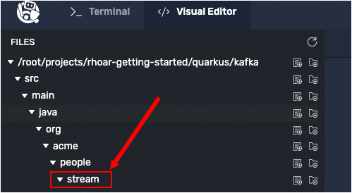
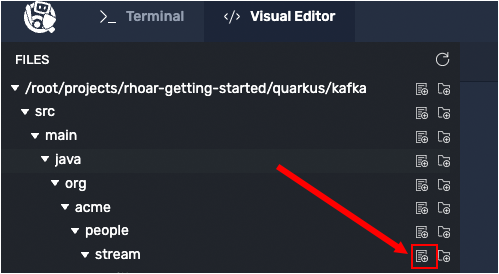
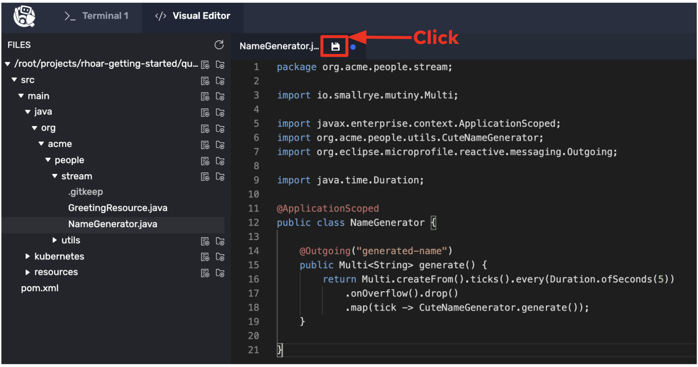

In this topic you will create a Java class named, `NameGenerator` has a method named `generate()`that returns an active stream.

# Creating the `NameGenerator` class

`Step 1:` Click the **Visual Editor** tab on the horizontal menu bar over the terminal window to the left.

----

`Step 2:` Use the Visual Editor's directory tree to navigate to the directory, `/root/projects/rhoar-getting-started/quarkus/kafka/src/main/java/org/acme/people/stream/`, as shown in the figure below:



----

`Step 3:` Click the `New File` icon to the right of the `./stream` directory as shown in the figure below:



A New File dialog will appear.

----

`Step 4:` Create a file named `NameGenerator.java` as shown in the figure below:


----

`Step 5:` Click the `NameGenerator.java` file in the directory tree to open it and then copy and paste the following code into the file:

```java
package org.acme.people.stream;

import io.smallrye.mutiny.Multi;

import javax.enterprise.context.ApplicationScoped;
import org.acme.people.utils.CuteNameGenerator;
import org.eclipse.microprofile.reactive.messaging.Outgoing;

import java.time.Duration;

@ApplicationScoped
public class NameGenerator {

    @Outgoing("generated-name")
    public Multi<String> generate() {
        return Multi.createFrom().ticks().every(Duration.ofSeconds(5))
            .onOverflow().drop()
            .map(tick -> CuteNameGenerator.generate());
    }

}
```

Click on the `Disk` icon to save the files or press `CTRL+S` as shown in the figure below:



# Analyzing `NameGenerator.generate()`

The `NameGenerator.generate()` method does the following:

* Gets a **cute name** from the function `CuteNameGenerator.generate()`. The `CuteNameGenerator.generate()` is particular to the demonstration application. An example of a cute name is `Crimson Frill`.
* Tells reactive messaging to dispatch the items from the returned stream to an outgoing stream named `generated-name`.
* Returns a [Mutiny](https://smallrye.io/smallrye-mutiny/) `Multi` object. A `Multi` object represents a stream of data that can emit 0, 1, n, or an infinite number of items. In this case the `Multi` stream emits a random name every five seconds

The method returns a [reactive stream](http://www.reactive-streams.org/). The generated items are sent to the stream named `generated-name`. This stream is mapped to Kafka using the `application.properties` file that you will create in an upcoming topic.

**Congratulations!**

You've created the Java code that creates a cute name. Also, you used the `Mutiny` library to bind cute name generation to a data stream.

----

**NEXT:** Processing a stream data
