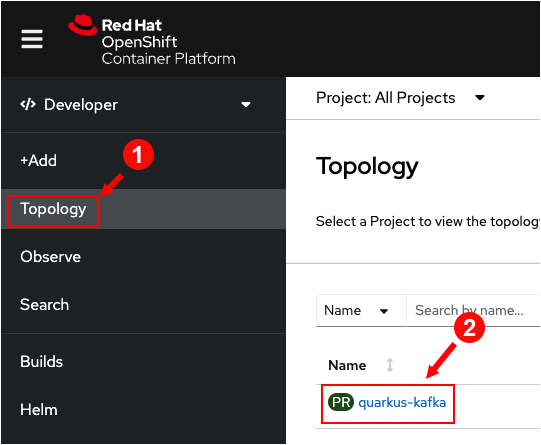
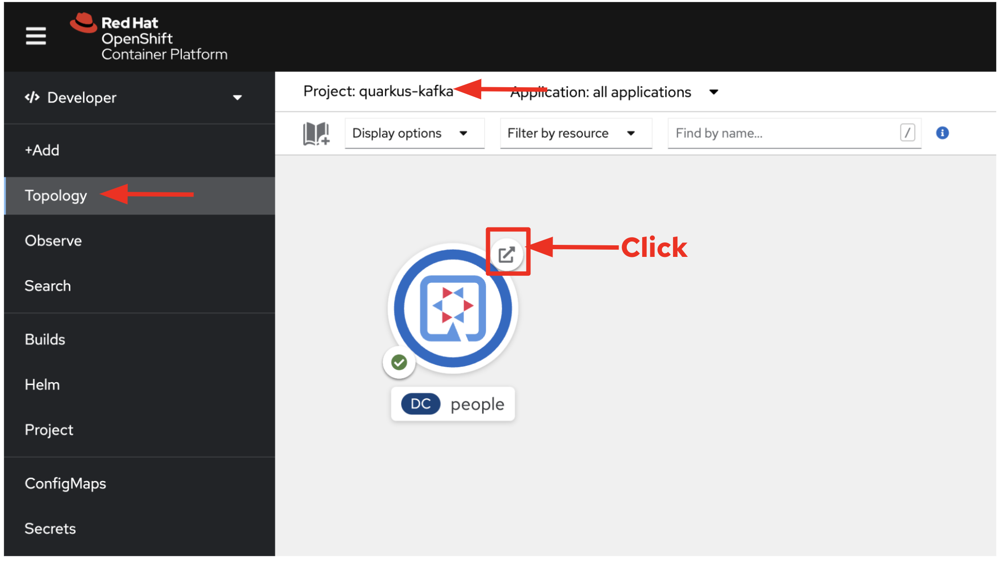

In this topic you will install the Quarkus application in OpenShift, and then add the OpenShift extensions to Quarkus. Then, you'll add configuration settings for Quarkus and Openshift to the demonstration application's `application.properties` file.

You'll package and deploy the Quarkus application into OpenShift from the command line. Finally, you'll access the demonstration application's web site using the OpenShift web console.

# Understanding the OpenShift extension

Quarkus offers the ability to automatically generate OpenShift resources based on default and user supplied configuration settings. You add the OpenShift extension to Quarkus to integrate Quarkus with OpenShift.

The OpenShift extension is actually a wrapper that brings together the [kubernetes](https://quarkus.io/guides/deploying-to-kubernetes) and [container-image-s2i](https://quarkus.io/guides/container-image#s2i) extensions with sensible defaults so that it’s easier for the user to get started with Quarkus on OpenShift.

# Installing the OpenShift extension

`Step 1:` Run the following command in the **Terminal 1** window to the left to add the OpenShift extensions to the Quarkus demonstration application:

```
mvn quarkus:add-extension -Dextensions="openshift" -f /root/projects/rhoar-getting-started/quarkus/kafka
```

You'll get some screen output and then finally:

```
[INFO] --------------------------< org.acme:people >---------------------------
[INFO] Building people 1.0-SNAPSHOT
[INFO] --------------------------------[ jar ]---------------------------------
[INFO]
[INFO] --- quarkus-maven-plugin:2.0.0.Final:add-extension (default-cli) @ people ---
[INFO] [SUCCESS] ?  Extension io.quarkus:quarkus-openshift has been installed
[INFO] ------------------------------------------------------------------------
[INFO] BUILD SUCCESS
[INFO] ------------------------------------------------------------------------
```

----

`Step 2:` Click the **Visual Editor** tab on the horizontal menu bar over the terminal window on the left.

----

`Step 3:` Using the Visual Editor, navigate to the file `application.properties` in the directory `/root/projects/rhoar-getting-started/quarkus/kafka/src/main/resources/` as shown in the figure below.


----

`Step 4:` In the Visual Editor directory tree, click the file named `application.properties` to open it for editing.

----

`Step 5:` Add the following text to the file `application.properties`. Be careful not to overwrite the text that is already in the file:

```java
# Configure the OpenShift extension options
quarkus.kubernetes-client.trust-certs=true
quarkus.kubernetes.deploy=true
quarkus.kubernetes.deployment-target=openshift
quarkus.openshift.expose=true
```

----

`Step 6:` Click on the `Disk` icon or press `CTRL+S` to save the file.

The following list describes the meaning of each key-value entry you just made in `application.properties`:

* `quarkus.kubernetes-client.trust-certs=true` - Indicates that self-signed certificates are used by OpenShift and they are to be trusted.
* `quarkus.kubernetes.deploy=true` - Tells the extension to deploy the container image to OpenShift after the container image is built.
* `quarkus.kubernetes.deployment-target=openshift` - Tells the OpenShift extension to generate and create the OpenShift resources (such as `DeploymentConfig`s and `Service`s) after building the container.
* `quarkus.openshift.expose=true` - Tells the extension to generate an OpenShift `Route`.

You will now deploy the demonstration application into OpenShift. First you will use the `oc` command line tool to log into the OpenShift cluster as the user named `developer`.

# Logging into OpenShift

`Step 7:` Run the following command in **Terminal 1** to log into the OpenShift cluster using the `oc` command line tool:

```
oc login -u developer -p developer
```

You will see the following:

```
Login successful.

You don't have any projects. You can try to create a new project, by running

oc new-project <projectname>
```

# Creating another new project

`Step 8:` Run the following command in **Terminal 1** to create a new project named `Quarkus on Kafka`. (You'll deploy the demonstration application into the project in upcoming steps):

```
oc new-project quarkus-kafka --display-name="Quarkus on Kafka"
```

You'll see output similar to the following:

```
Now using project "quarkus-kafka" on server "https://api.crc.testing:6443".

You can add applications to this project with the 'new-app' command. For example, try:

    oc new-app rails-postgresql-example

to build a new example application in Ruby. Or use kubectl to deploy a simple Kubernetes application:

    kubectl create deployment hello-node --image=k8s.gcr.io/serve_hostname
```

# Deploying an application to OpenShift

Now let's deploy the application into the OpenShift project.

----

`Step 9:` Run the following command in **Terminal 1** to build and deploy the application under Maven using the OpenShift extension for Quarkus:

```
mvn clean package -f /root/projects/rhoar-getting-started/quarkus/kafka
```

You'll get a lot of screen output. Also, executing `mvn clean package` can take a minute or two.

|NOTE:|
|----|
|The command `mvn clean package` will take a minute or two to complete because it builds the app, pushes a container image into a repository, and finally deploys the container to OpenShift.|

Finally, upon success you'll see output similar to the following:

```
[INFO] [io.quarkus.deployment.QuarkusAugmentor] Quarkus augmentation completed in 183245ms
[INFO] ------------------------------------------------------------------------
[INFO] BUILD SUCCESS
[INFO] ------------------------------------------------------------------------
```

Make sure the application deployment is actually finished rolling out:

----

`Step 10:` Run the following command in **Terminal 1** to determine when the rollout is complete:

```
oc rollout status -w dc/people
```

Wait for that command to report `replication controller "people-1" successfully rolled out` before continuing.

# Opening the OpenShift web console

OpenShift ships with a web-based console that allows users to perform various tasks via a browser. You will use the web console to view the demonstration application running under OpenShift. Also, you will use the web console to access the demonstration application's website from a URL that is generated by OpenShift.

----

`Step 11:` Click on `Web Console` tab on the horizontal menu bar over the terminal window to the left.

You will be presented with a login page as shown in the figure below.


----

`Step 12:`  Log into the web console using the following credentials:

* Username: `developer`
* Password: `developer`

|NOTE:|
|----|
|You might see the following warning notification due to using an untrusted security certificate.


If you do get the warning, click the **Advanced** button to grant permission to access the OpenShift Web Console.|

----

`Step 13:` After you log in you will be presented with a dialog offering to give a tour of the OpenShift environment. Skip the tour.

----

`Step 14:` Once in the web console, click the **Topology** tab on the vertical menu on the left side of the web console page. Then click the link `quarkus-kafka` in the projects list as shown in the figure below.



You will be presented with a circular graphic that represents the Quarkus/Kafka application which is named `people`.

----

`Step 15:` Click the `Open URL` icon on the upper right side of the circular graphic as shown in the figure below.



Clicking the `Open URL` icon will open a web page in your browser that's bound to the `people` application.

Once the app gets warmed up in about 5-10 seconds, the web page will display a cute name every five seconds as shown in the figure below:


|BE ADVISED!|
|----|
|It takes about five to ten minutes for the Quarkus application to get up and running in it's entirety. It takes a few seconds to establish the connection to Kafka. Also, the browser converts the cute names to SVG images for display. Thus, rendering a cute name can take time too. <br><br>If you do not see cute names rendered after waiting 10 seconds, reload the browser page to re-initialize the SSE stream.|

# BONUS SECTION: Open the solution in an IDE in the cloud!

Want to continue exploring this solution on your own in the cloud? You can use the free [Red Hat OpenShift Dev Spaces](https://developers.redhat.com/products/openshift-dev-spaces/overview) IDE running on the free [Developer Sandbox for Red Hat OpenShift](http://red.ht/dev-sandbox). [Run here](https://workspaces.openshift.com) to login or to register if you are a new user. This free service expires after 30 days, but you can always enable a new free 30-day subscription.

Once logged in, [run here](https://workspaces.openshift.com/f?url=https://raw.githubusercontent.com/openshift-katacoda/rhoar-getting-started/solution/quarkus/kafka/devfile.yaml) to open the solution for this project in the cloud IDE. While loading, if it asks you to update or install any plugins, you can say no.

# Congratulations!

This guide has shown how to interact with Kafka using Quarkus. It utilizes MicroProfile Reactive Messaging to build
data streaming applications.

If you want to go further, check the documentation of [SmallRye Reactive
Messaging](https://smallrye.io/smallrye-reactive-messaging), the implementation used in Quarkus.

**Congratulations!**

In this topic you installed the Quarkus application in OpenShift. You added the OpenShift extensions to Quarkus. Then, you added configuration settings for Quarkus and Openshift to the demonstration application's `application.properties` file.

You packaged and deployed the Quarkus application into OpenShift from the command line. Finally, you accessed the demonstration application's web site using the OpenShift web console.

----

This is the final topic in this track.
