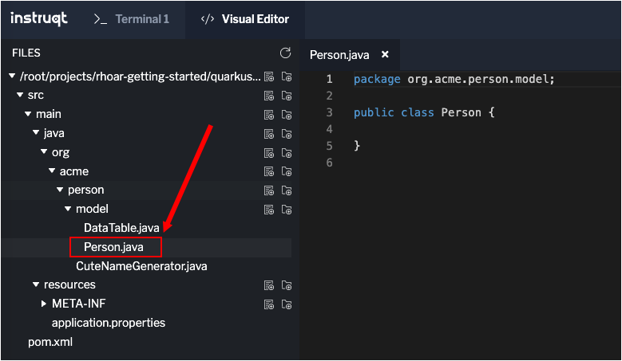
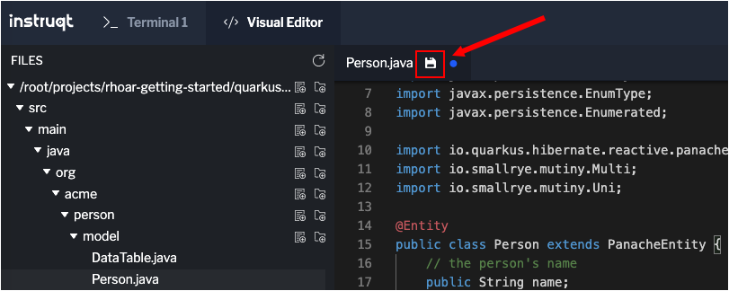
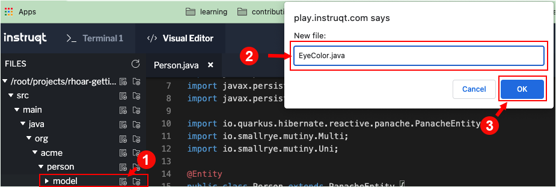
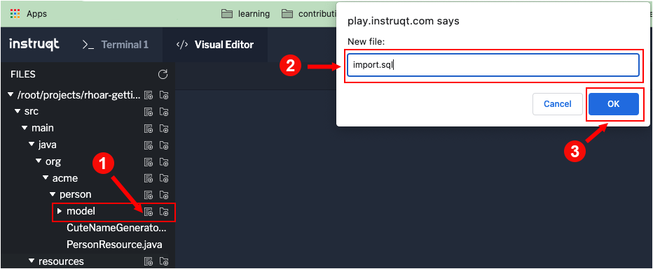

The objective of this topic is to develop a reactive application starting with predefined source code. The application you will develop is illustrated in the figure below.


You'll build out the code for a RESTful API. The RESTful API code is stored in a file named `PersonResource.java`. Also, you'll add queries to a data entity that is defined in the file named `Person.java`. `Person.java` extends [`PanacheEntity`](https://javadoc.io/doc/io.quarkus/quarkus-hibernate-orm-panache/latest/io/quarkus/hibernate/orm/panache/PanacheEntity.html). `PanacheEntity` enables asynchronous interaction with the Hibernate ORM which represents the underlying Postgres database in which the application's data is stored.

----

In this track you will clone the source code for the demonstration project from GitHub. Then, you'll build out the predefined `Person.java` entity. Finally you'll create and code the files `PersonResource.java`, `EyeColor.java` and `import.sql`.

# Inspecting the Java runtime

`Step 1:` Run the following command in the **Terminal 1** console window to the left to verify that the Java Runtime (JRE) is installed:

```
$JAVA_HOME/bin/java --version
```

You will get output similar to the following:

```
openjdk 17.0.6 2023-01-17
OpenJDK Runtime Environment Temurin-17.0.6+10 (build 17.0.6+10)
OpenJDK 64-Bit Server VM Temurin-17.0.6+10 (build 17.0.6+10, mixed mode, sharing)
```

|NOTE|
|----|
|If the command to verify the JRE fails, wait a few moments and try again. The JRE is installed in a background process and might take a few moments to get up and running, depending on system load).|

# Importing the code from GitHub

`Step 2:` Run the following command in the **Terminal 1** console window to download the source code for the demonstration application from GitHub:

```
cd /root/projects && rm -rf rhoar-getting-started && git clone https://github.com/openshift-katacoda/rhoar-getting-started
```

You will get output similar to the following:

```
Cloning into 'rhoar-getting-started'...
remote: Enumerating objects: 2603, done.
remote: Counting objects: 100% (157/157), done.
remote: Compressing objects: 100% (82/82), done.
remote: Total 2603 (delta 108), reused 90 (delta 74), pack-reused 2446
Receiving objects: 100% (2603/2603), 1.15 MiB | 6.63 MiB/s, done.
Resolving deltas: 100% (906/906), done.
```

----

`Step 3:` Run the following command in the **Terminal 1** console window to navigate to the working directory for the demonstration application:


```
cd /root/projects/rhoar-getting-started/quarkus/panache-reactive && pwd
```

You will see the following output:

```
/root/projects/rhoar-getting-started/quarkus/panache-reactive
```
# Installing the Hibernate ORM with Panache and PostgreSQL JDBC extensions

`Step 4:` Run the following command in the **Terminal 1** to add the Quarkus Hibernate ORM with Panache and PostgreSQL JDBC extensions to the demonstration application:

```
mvn quarkus:add-extension -Dextensions="hibernate-reactive-panache, reactive-pg-client"
```

There will be a good deal of screen output. You'll see output similar to the following when the installation successfully completes:

```console
[SUCCESS] ✅ Extension io.quarkus:quarkus-hibernate-reactive-panache has been installed
[SUCCESS] ✅ Extension io.quarkus:quarkus-reactive-pg-client has been installed
[INFO] ------------------------------------------------------------------------
[INFO] BUILD SUCCESS
[INFO] ------------------------------------------------------------------------
```
You are now ready to start building out the source code from the demonstration application.

|NOTE|
|----|
| There are [many Quarkus extensions](https://quarkus.io/extensions/) for popular frameworks such as [Eclipse Vert.x](https://vertx.io), [Apache Camel](http://camel.apache.org/), [Infinispan](http://infinispan.org/), Spring DI compatibility (e.g. `@Autowired`), and more. To learn about the basics of Quarkus usage, take a look at the [Getting Started](https://developers.redhat.com/learn/openshift/developing-openshift-applications-java-and-quarkus) course.|

# Understanding the demonstration application's source code

The source code for this project doesn't do anything. It just contains some files.

The purpose of the source code is to be a starting point from which to build out the project into a fully functional reactive application. The structure of the code matches what you might get when generating sample projects [using the Quarkus Project Generator](https://code.quarkus.io).

You'll work with the source code using the Visual Editor that is already installed in this interactive learning environment. You access the visual editor by clicking the **Visual Editor** tab on the horizontal menu bar over the console window to the left.

# Defining the entity

The demonstration application uses a collection of `Person` entity objects. The data from the `Person` entities is stored in a Postgres database. A `Person` entity has the properties `name`, `birthdate`, and `eyes`. (The `eyes` property represents eye color.)

The first piece of work you'll do is to modify the source code by adding content to the Java file that defines the `Person` data entity.

----

`Step 5a:` Click the **Visual Editor** tab on the horizontal menu bar over the console window to the left. You be presented with the source code from the demonstration project.

`Step 5b:` In the **Visual Editor**, navigate to the file `src/main/java/org/acme/person/model/Person.java` as shown in the figure below.



`Step 5c:` In the **Visual Editor**, **replace** the contents of the file `src/main/java/org/acme/person/model/Person.java` with the following code that redefines the `Person` data entity:


```java
package org.acme.person.model;
import java.time.LocalDate;
import java.util.List;

import javax.persistence.Column;
import javax.persistence.Entity;
import javax.persistence.EnumType;
import javax.persistence.Enumerated;

import io.quarkus.hibernate.reactive.panache.PanacheEntity;
import io.smallrye.mutiny.Multi;
import io.smallrye.mutiny.Uni;

@Entity
public class Person extends PanacheEntity {
    // the person's name
    public String name;

    // the person's data of birth
    public LocalDate birth;

    // the person's eye color
    @Enumerated(EnumType.STRING)
    @Column(length = 8)
    public EyeColor eyes;

    public Person() {
    }

    public Person(String name, LocalDate birth, EyeColor eyes) {
        this.name = name;
        this.birth = birth;
        this.eyes = eyes;
    }

    // TODO: Add more queries
}
```

|BEWARE|
|----|
|In the source code file, `src/main/java/org/acme/person/model/Person.java` you will see a `// TODO` comment at `Line XX`. **Do Not Delete It!** You will need this comment later on.|

`Step 5d:` Click on the `Disk` icon or press `CTRL+S` to save the contents of the Java file as shown in the figure below.



# Defining the eye color enum

You previously defined the `Person` entity to have the fields `name`, `birth`, and `eyes`. The `eyes` field is an enumeration type that is defined as follows using the Java Persistence API's `@Enumerated` annotation, like so:

```java
    // the person's eye color
    @Enumerated(EnumType.STRING)
    @Column(length = 8)
    public EyeColor eyes;
```

However, the source code does not yet have the code that defines the enumeration `EyeColor`. You will create the enumeration now.

----

`Step 6a:` In the **Visual Editor**, navigate to the directory `src/main/java/org/acme/person/model`.


`Step 6b:` Click the create file icon to create the file named `EyeColor.java` as shown in the figure below.



`Step 6c:` Click the newly created `EyeColor.java` to open the file for editing and add the following code:

```java
package org.acme.person.model;

public enum EyeColor {
    BLUE, GREEN, HAZEL, BROWN
}
```

`Step 6d:` Click on the `Disk` icon or press `CTRL+S` to save the contents of `EyeColor.java`.

You've created the `EyeColor` enumeration.

Next, you'll create a RESTful endpoint by which to access the `Person` resource.

# Defining the RESTful endpoint

The following steps create the first endpoint for accessing data in the demonstration application's RESTful API.

`Step 7a:` In the **Visual Editor**, navigate to the directory `src/main/java/org/acme/person/`.


`Step 7b:` Click the create file icon to create the file named `PersonResource.java` as shown in the figure below.


`Step 7c:` Click the newly created `src/main/java/org/acme/person/PersonResource.java` to open the file for editing and add the following code:

```java
package org.acme.person;

import java.time.LocalDate;
import java.util.List;
import java.util.Optional;
import java.util.stream.Collectors;
import java.util.stream.IntStream;

import javax.enterprise.event.Observes;
import javax.ws.rs.GET;
import javax.ws.rs.Path;
import javax.ws.rs.PathParam;
import javax.ws.rs.Produces;
import javax.ws.rs.QueryParam;
import javax.ws.rs.core.MediaType;

import org.acme.person.model.DataTable;
import org.acme.person.model.EyeColor;
import org.acme.person.model.Person;

import io.quarkus.hibernate.reactive.panache.Panache;
import io.quarkus.hibernate.reactive.panache.PanacheQuery;
import io.quarkus.panache.common.Parameters;
import io.quarkus.runtime.StartupEvent;
import io.smallrye.mutiny.Multi;
import io.smallrye.mutiny.Uni;

@Path("/person")
public class PersonResource {

    @GET
    @Produces(MediaType.APPLICATION_JSON)
    public Uni<List<Person>> getAll() {
        return Person.listAll();
    }

    // TODO: add basic queries

    // TODO: add data-table query

    // TODO: Add lifecycle hook

}
```

`Step 7d:` Click on the `Disk` icon or press `CTRL+S` to save the contents of `EyeColor.java`.

|NOTE|
|----|
|You will see many `// TODO` comments in the file, `src/main/java/org/acme/person/PersonResource.java`. **Do Not Delete Them!** You will need these comments later on.|

**IMPORTANT CONCEPTS TO UNDERSTAND**

* `@Path("/person")` - Indicates the path to the `Person` resource that is appended to the base URL of the RESTful API
* `@GET` - Indicates the the API call will use the [HTTP GET method](https://developer.mozilla.org/en-US/docs/Web/HTTP/Methods/GET).
* `getAll` - Is the Java function that will be executed with the request to the `/person` endpoint is received by the server
* [`@Produces(MediaType.APPLICATION_JSON)`](https://docs.oracle.com/javaee/7/api/javax/ws/rs/core/MediaType.html) - Indicates that the response will be returned as JSON.
* `Uni<T>` - A data type defined in the [Mutiny library]((https://javadoc.io/doc/io.smallrye.reactive/mutiny/latest/io/smallrye/mutiny/package-summary.html)) that represents a lazy asynchronous action.

# Adding the sample data

The next step in this topic is to add sample data to the demonstration application's database. You'll add a file that contains the SQL statements that do the work of inserting the sample data.

----

`Step 8a:` In the **Visual Editor**, navigate to the directory `src/main/resources/`.

`Step 8b:` Click the create file icon to create the file named `import.sql` as shown in the figure below.



`Step 8c:` Click the file `src/main/resources/import.sql` to open the file for editing and add the following code:

```sql
INSERT INTO person(id, name, birth, eyes) VALUES (nextval('hibernate_sequence'), 'Farid Ulyanov', to_date('1974-08-15', 'YYYY-MM-dd'), 'BLUE');
INSERT INTO person(id, name, birth, eyes) VALUES (nextval('hibernate_sequence'), 'Salvador L. Witcher', to_date('1984-05-24', 'YYYY-MM-dd'), 'BROWN');
INSERT INTO person(id, name, birth, eyes) VALUES (nextval('hibernate_sequence'), 'Huynh Kim Hue', to_date('1999-04-25', 'YYYY-MM-dd'), 'HAZEL');
```
`Step 8d:` Click on the `Disk` icon or press `CTRL+S` to save the contents of `src/main/resources/import.sql`.

In topics to come, the file `src/main/resources/import.sql` will inject three fake people into the database that will be associated with the demonstration application.

# Congratulations!

In this topic you imported the source code for the demonstration application. You added the Hibernate Reactive Panache plugin to Quarkus. Also, you started adding and refactoring source code files that will be used in topics to come.

----

**NEXT:** Setting up data access and implementing remote Live Coding