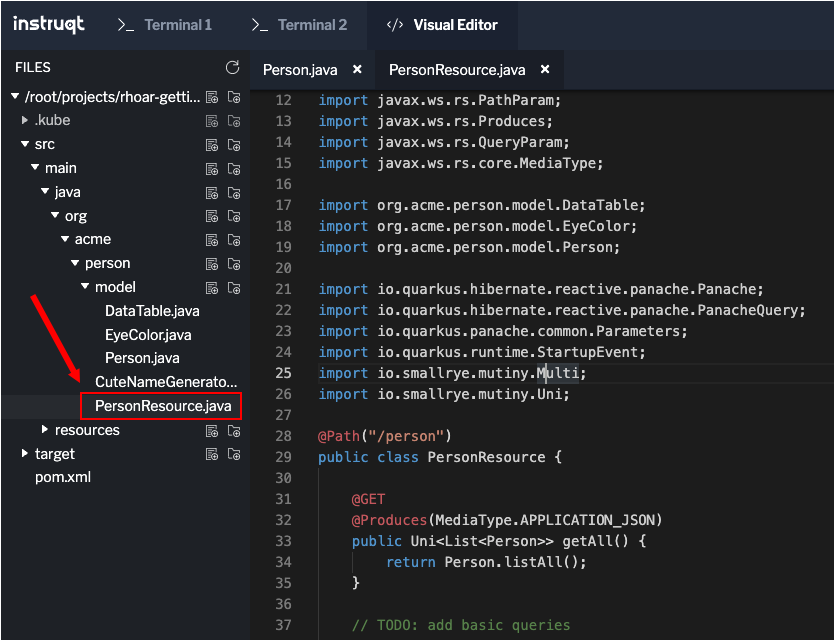

In the previous topic you built a query that included filtering, searching, and paging capabilities. In this topic you'll add a Quarkus lifecycle hook to populate the database with 10k records upon startup.

# Adding the lifecycle hook

You often need to execute custom actions when the application starts and clean up everything when the application stops. In this case we'll add an action that will pre-generate a lot of fake data.

Managed beans (like the `PersonResource`) can listen for lifecycle events by using the `@Observes` annotation on method signatures, which will be called when the associated event occurs.

----

`Step 1a:` From the **Visual Editor** tab, navigate to the folder `src/main/java/org/acme/person/`.

`Step 1b:` Click on the file `PersonResource.java` to open it for editing as shown in the figure below.



`Step 1c: ` Add the following code after the `// TODO: Add lifecycle hook` comment:

```java
    void onStart(@Observes StartupEvent ev) {
        // Create a reactive pipeline that will create 10,000 people
        List<Uni<Person>> people = IntStream.range(0, 10000)
            .mapToObj(i -> CuteNameGenerator.generate())
            .map(name -> {
                LocalDate birth = LocalDate.now().plusWeeks(Math.round(Math.floor(Math.random() * 20 * 52 * -1)));
                EyeColor color = EyeColor.values()[(int)(Math.floor(Math.random() * EyeColor.values().length))];

                return new Person(name, birth, color);
            })
            .map(person -> person.<Person>persist())
            .collect(Collectors.toList());

        // Execute the pipeline inside a single transaction, waiting for it to complete
        Panache.withTransaction(() ->
            Uni.combine()
                .all()
                .unis(people)
                .combinedWith(l -> null)
        ).await().indefinitely();
    }
```

`Step 1d:` Click on the `Disk` icon or press `CTRL+S` to save the contents of `PersonResource.java`.

|NOTE|
|----|
|Adding 10k entries will make the demonstration application's startup time artificially high, around 5-10 seconds.|

The code added above will insert 10,000 fake people into the database. Each person will have a random birth date, eye color, and name at startup.

Let's test it out and see if it picks up our new data.

----

`Step 2:` Run the following code in **Terminal 1** to search for people that have a name that contains the single letter `F` and limits the results to two records:

```
curl -s "$APP_URL/person/datatable?draw=1&start=0&length=2&search\[value\]=F" | jq
```

You will get up to two records returned, but the total number available will show many more people. The total number of records should now be `10003`, the 10k we added plus the three original values entered in previous topics:

```json
{
  "data": [
    {
      "id": 1,
      "birth": "1974-08-15",
      "eyes": "BLUE",
      "name": "Farid Ulyanov"
    },
    {
      "id": 10,
      "birth": "2001-11-26",
      "eyes": "GREEN",
      "name": "Phantom Finger"
    }
  ],
  "draw": 1,
  "recordsFiltered": 1316,
  "recordsTotal": 10003
}
```

Notice the values for `recordsFiltered` (the number of records with the letter `F` in the name), and `recordsTotal`. The value you see for `recordsFiltered` may be different than the above value, since the number of records with an `F` in the name may vary because the data is random.

# Congratulations

You have successfully written a lifecycle hook to listen for a `StartupEvent`. Any time the application is started, the event this method will execute. You can also use `@Observes` with the [`io.quarkus.runtime.StartupEvent`](https://quarkus.io/guides/lifecycle#listening-for-startup-and-shutdown-events) to do cleanup when the application is gracefully stopped.

In the next topic you'll exercise the demonstration application's web page and the DataTables GUI that is backed by the remote, high-performance Quarkus application.

----

**NEXT:** Exercising the demonstration application's web page