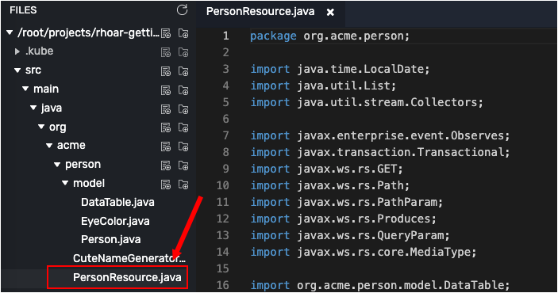

In the previous topic you built a query that included filtering, searching, and paging capabilities. In this topic you'll add a Quarkus lifecycle hook that will pre-populate the database with 10,000 records.

# Adding a lifecycle hook

A commonplace need in application design is to automatically execute custom actions when an application starts, and clean up activities when the application stops. Lifecycle hooks meet this need.

The way that developers program a managed beans to know how to execute behavior in reaction to an application event is by using the `@Observes` annotation to decorate method signatures.

In this topic, you'll decorate the `PersonResource` bean with the `@Observes` annotation to listen for a start up event and respond accordingly. The behavior of the startup action generates 10,00 records of person data into the application's database.

No shut down behavior will be implemented at this time. However, the concept and technique behind applying startup behavior can be applied to shutdown behavior later on.

----

`Step 1:` Click the the **Visual Editor** tab on the horizontal menu bar over the terminal window to the left.

----

`Step 2:` Navigate to the file `src/main/java/org/acme/person/PersonResource.java` in the Visual Editor's directory tree and click the file named `PersonResource.java` to open it for editing as shown in the figure below.



----
`Step 3:` Add the following code to the file `PersonResource.java`, placing the code **after** the comment line: `//TODO: Add lifecycle hook`:


```java
    @Transactional
    void onStart(@Observes StartupEvent ev) {
        for (int i = 0; i < 10000; i++) {
            String name = CuteNameGenerator.generate();
            LocalDate birth = LocalDate.now().plusWeeks(Math.round(Math.floor(Math.random() * 20 * 52 * -1)));
            EyeColor color = EyeColor.values()[(int)(Math.floor(Math.random() * EyeColor.values().length))];
            Person p = new Person();
            p.birth = birth;
            p.eyes = color;
            p.name = name;
            Person.persist(p);
        }
    }
```

----

`Step 4:` Save the file `PersonResource.java` by clicking the `Disk` icon or pressing the `CTRL+S` keys.

The `onStart(@Observes StartupEvent ev)` code shown above inserts into the underlying database 10,000 `people` objects at startup. Each record has a random cute name, birth date, and eye color.

Even though the application was started in `quarkus:dev` mode in a previous topic, Quarkus will nonetheless fire the `startup` event once the code is saved despite the fact the application is already running.

Hence the database will be populated with 10,000 new records.

Let's run an informal test to verify that the application has the new data.

|NOTE:|
|----|
|Adding 10,000 entries will make the application's startup time artificially high, around five to 10 seconds.|

`Step 5:` Run the following command in **Terminal 1** to search all records in the database, new and old, for entries that have the character `F`. Also, limit the search results to `2` records:

```
curl -s "$APP_URL/person/datatable?draw=1&start=0&length=2&search\[value\]=F" | jq
```

You will get up to two records returned:

```json
{
  "data": [
    {
      "id": 1,
      "birth": "1974-08-15",
      "eyes": "BLUE",
      "name": "Farid Ulyanov"
    },
    {
      "id": 10,
      "birth": "2001-11-26",
      "eyes": "GREEN",
      "name": "Phantom Finger"
    }
  ],
  "draw": 1,
  "recordsFiltered": 1316,
  "recordsTotal": 10003
}
```

Notice in the JSON shown above that the total number of records available is indicated by the JSON property-value pair `"recordsTotal": 10003`. The search result shows that the total number of records is now `10003` which the 10,000 records just added plus the three original entries.

Also, be advised that the number of records actually reported in your response will probably differ from the number shown above. Remember, the cute names are generated at random. Random generation will probably create a varying number of names with the character `F`.

# Congratulations

You have successfully written a lifecycle hook to listen for a `StartupEvent`.

Remember, anytime the application is started it will fire a `StartupEvent`, and as a result invoke the `onStart(@Observes StartupEvent ev)` method.

In addition to programming to a `StartupEvent`, you can also use `@Observes ShutdownEvent` to do cleanup actions when the application is gracefully stopped.

In the next step you'll exercise the DataTables GUI that's bound to the Quarkus application on the back end.

----

**NEXT:** Exercising data queries using the demonstration application's web GUI