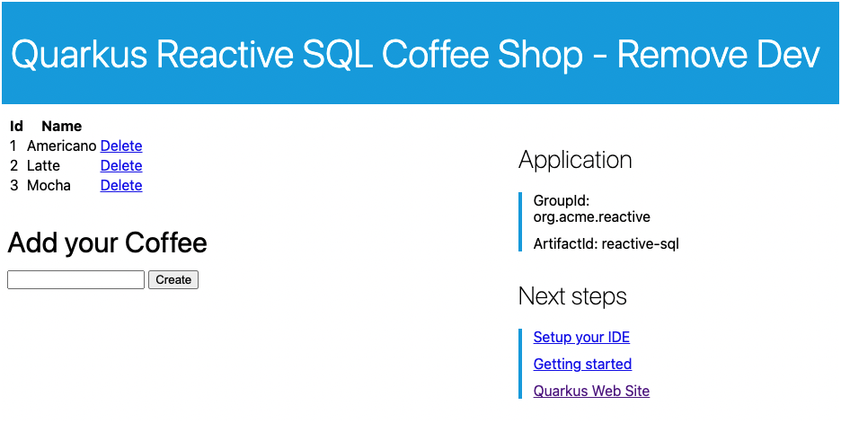

In the previous topic you updated the `Coffee` class by adding a new method `findById()` method. In this topic you will redeploy the demonstration application release the additional data access capabilities. Also, you will see the results of the deployment in the demonstration application's web page.

----

`Step 1:` Run the following command in the **Terminal 1** console window to redeploy the demonstration application:

```
cd /root/projects/rhoar-getting-started/quarkus/reactive-sql && \
  mvn clean package -DskipTests \
  -Dquarkus.kubernetes.deploy=true \
  -Dquarkus.kubernetes-client.trust-certs=true \
  -Dquarkus.kubernetes.deployment-target=openshift \
  -Dquarkus.openshift.route.expose=true \
  -Dquarkus.openshift.annotations.\"app.openshift.io/connects-to\"=database
```

There will be good deal of screen output. Eventually, upon a successful installation, you will see output similar to the following:

```
INFO] ------------------------------------------------------------------------
[INFO] BUILD SUCCESS
[INFO] ------------------------------------------------------------------------
```

----

`Step 2:` Run the following command in **Terminal 1** to verify that the rollout of the demonstration application was successful:

```
oc rollout status -w dc/reactive-sql
```

Eventually you will see output similar to the following:

```
Waiting for rollout to finish: 1 old replicas are pending termination...
Waiting for rollout to finish: 1 old replicas are pending termination...
Waiting for latest deployment config spec to be observed by the controller loop...
replication controller "reactive-sql-3" successfully rolled out
```

|NOTE|
|----|
|If the `oc rollout` command seems to not be finishing, press the `CTRL+C` keys to terminate the process. Then run `oc rollout` again.


----

`Step 3:` Run the following command in **Terminal 1** to get the demonstration application's Route URL:

```
oc get route reactive-sql -n reactive-sql -o jsonpath='{"http://"}{.spec.host}'
```

----

`Step 4:` Copy the URL from the output above command and paste it in a browser's address bar.

----

`Step 5:` You will see new functionality added to the demonstration application's web page as shown in the figure below:




# Congratulations!

This is the last topic in the track.

You updated the demonstration application with additional capabilities. You learned a bit more about the mechanics of packaging, deploying and maintaining a Quarkus application.

Also, in this tutorial you used JAX-RS and learned how to install the demonstration application in Red Hat OpenShift Container Platform.

This is the last topic in this track. To read more about Quarkus and Reactive SQL go to the [QuarkusIO](http://www.quarkus.io) web site for more details.

----

# BONUS SECTION:

**Open the solution in an IDE in the Cloud!**

Want to continue exploring this solution on your own in the cloud?

You can use the free [Red Hat OpenShift Dev Spaces](https://developers.redhat.com/products/openshift-dev-spaces/overview) IDE running on the [Developer Sandbox for Red Hat OpenShift](http://red.ht/dev-sandbox) to get more insight into working with Quarkus and reactive programming.

[Click here](https://workspaces.openshift.com) to register and log into Red Hat Workspaces. This free service expires after 30 days, but you can always renew a new free 30-day subscription.

Once logged in, [click here](https://workspaces.openshift.com/f?url=https://raw.githubusercontent.com/openshift-katacoda/rhoar-getting-started/solution/quarkus/reactive-sql/devfile.yaml) to open the solution for this project in the cloud IDE. While loading, if the sandbox asks you to update or install any plugins, you can say no.

# What's Next?

Congratulations on completing this lab. Keep learning about OpenShift:

* Visit the [Red Hat Developer learning page](https://developers.redhat.com/learn) for more labs and resources
* [Want to try a free, instant 30-day OpenShift cluster? Get started with the Developer Sandbox for Red Hat OpenShift](https://developers.redhat.com/developer-sandbox)

Don't forget to finish the lab and rate your experience on the next page. Thanks for playing!
