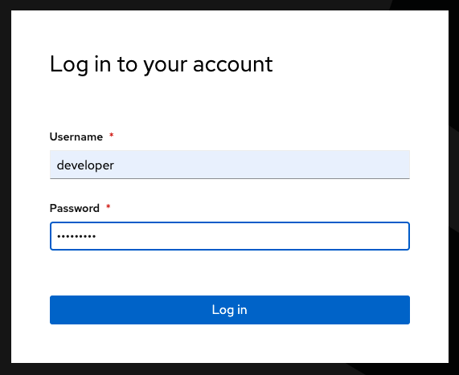
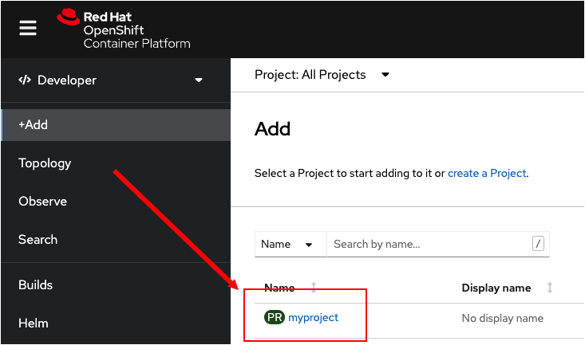

In this topic you will learn how to log into an OpenShift cluster from the command line, and also by using the web console.

----

`Step 1:` Run the following command in the terminal window to the left to log into the OpenShift cluster as **Username:** `developer` with **Password:** `developer`:

```
oc login -u developer -p developer https://api.crc.testing:6443 --insecure-skip-tls-verify=true
```

You will see the following output when your login is successful:

```
Login successful.

You don't have any projects. You can try to create a new project, by running

    oc new-project <projectname>
```

Once you are logged in, you will create a new project named, `myproject`.

----

`Step 2:` Run the following command to create a project named, `myproject`:

```
oc new-project myproject
```

You will see the following output upon success:

```
Now using project "myproject" on server "https://openshift:6443".

You can add applications to this project with the 'new-app' command. For example, try:

    oc new-app django-psql-example

to build a new example application in Python. Or use kubectl to deploy a simple Kubernetes application:

    kubectl create deployment hello-node --image=gcr.io/hello-minikube-zero-install/hello-node
```

----

`Step 3:`  Switch to the OpenShift web console by clicking the **Web Console** tab, which is the second tab in the horizontal menu bar at the top of the terminal window to the left.

----

`Step 4:`  Enter the **Username:** `developer` and **Password:** `developer` pair shown in the figure below.



You will see the list of projects you have access to. Since you only created the one project previously, you will see that project, as shown in the figure below.



----

`Step 5:`  Click on `myproject`. You will be presented with the **Topology** page as shown in the figure below.


Notice that the project has no resources.

# Congratulations!

You've just logged in to an OpenShift cluster using the command line as well as using the web console.

----

**NEXT:** Deploying an application from a container image using the web console
